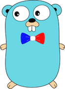

# [frenchgo.fr](https://frenchgo.fr)

## Objectifs
Site français autour du [Go](https://golang.org/doc/install). Ce site à pour vocation de regrouper les ressources nécessaires pour bien démarrer avec le langage.

Il alternera entre news, article de fond, interview des figures du langage et howto.

## Contribution
Les contributions sont les bienvenues, n'hésitez pas à ouvrir une [pull-request](https://github.com/frenchgofr/frenchgofr) pour soumettre une idée d'article.

## Ajouter un article

Le blog est propulsé par le moteur de blog [Hugo](https://gohugo.io/)

Pour ajouter un article au blog la marche à suivre est la suivante.

* Se placer dans le répertoire `blog` : 

        cd blog
        
* Ajouter un article avec la commande suivante :
        
        hugo new post/mon_article.md   
        
* Les ressources sont dans static, voir les autres articles pour le chemin d'accès.

* Pour test en local le rendu de votre article sur votre [poste](localhost:1313) :

        hugo server
        
* Pour préparer le rendu static à déployer :
        
        hugo                      

* Le répertoire `public` est mis à jour et le blog est prêt à être déployé sur App Engine :
    
        cd .. # racine de frenchgofr
        gcloud app deploy         

Et le tour est joué.

## Prise en main d'App Engine

        gcloud config set account xxx.yyyy@mail.co
        gcloud config set project projectName
        gcloud app deploy
        
